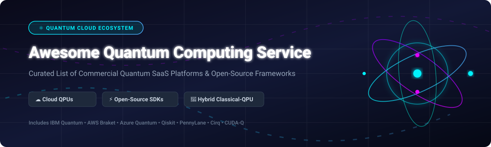

# Awesome Quantum Computing Service Ecosystem ⚛️

  

  
  
  
  
  

---

## 📌 Overview

**Curated List of SaaS Platforms & Open-Source Quantum Frameworks**  
*Focused on Quantum Cloud Access, Hybrid Algorithms, QPU Hardware & Open-Source Quantum Frameworks* 🚀

This repository tracks top-tier **commercial quantum computing services (Quantum SaaS)** and **open-source developer software** providing direct access to quantum processing units (QPUs), simulators, and quantum programming compilers. Whether you are building hybrid quantum-classical algorithms, benchmarking NISQ hardware, or researching fault-tolerant quantum error correction, this list serves as your developer handbook.

---

## 📑 Table of Contents

- [☁️ Commercial Quantum SaaS Platforms](#️-commercial-quantum-saas-platforms)
- [⚡ Open-Source GitHub Frameworks](#-open-source-github-frameworks)
- [🤝 How to Contribute](#-how-to-contribute)
- [💖 Support](#-support)
- [⭐ Star History](#-star-history)
- [⚠️ Disclaimer](#%EF%B8%8F-disclaimer)

---

## ☁️ Commercial Quantum SaaS Platforms

> 📊 **Market Insights**: The global Quantum Computing Market is estimated at **$1.3 Billion in 2026** and projected to reach over **$5.3 Billion by 2030** (CAGR ~38%). The sector is **moderately fragmented**, led by hyper-scaler cloud aggregators (AWS, Azure) and specialized hardware providers (IBM, IonQ, D-Wave), moving towards consolidated quantum cloud access ecosystems.

The following table summarizes top commercial quantum cloud providers, sorted by company scale (revenue/valuation descending):

| Platform / Company | Scale (Revenue / Valuation) 💰 | Starting Tier Pricing 🏷️ | Free Tier / Trial Limit 🎁 | Hardware & Features Summary 🛠️ |
| :--- | :--- | :--- | :--- | :--- |
| **[Google Quantum AI](https://quantumai.google/)** | **~$2.0 Trillion** *(Alphabet Valuation)* | $0.30 per minute QPU simulator execution | Free access to Cirq, QVM, & Google Colab GPU/TPU simulators | Willow chip (105 qubits, 99.97% fidelity). Achieved first verifiable quantum advantage with Quantum Echoes algorithm. Primary SDK is **Cirq**. |
| **[Amazon Braket](https://aws.amazon.com/braket/)** | **~$1.9 Trillion** *(Amazon Valuation)* | $0.30 per task + $0.00035 to $0.01 per shot | $10/month AWS credits for 12 months (up to 33,000 tasks/year) | Access to IonQ, Rigetti, IQM, QuEra & D-Wave. Features 11 pre-built algorithm libraries, Braket Direct reservations, and cost tracker context manager. |
| **[Azure Quantum](https://azure.microsoft.com/en-us/products/quantum)** | **~$3.1 Trillion** *(Microsoft Valuation)* | $0.005 per execution shot | $500 free credit grant per provider upon account signup | Unified access to Quantinuum, IonQ, Rigetti & Pasqal. Native **Q#**, Rust-based QDK 1.0, and Resource Estimator tool for quantum scalability. |
| **[IBM Quantum Platform](https://quantum.ibm.com/)** | **~$200 Billion** *(IBM Valuation)* | $1.60 per QPU second (Pay-As-You-Go) | 10 free QPU minutes per month for open plan users | Longest-running quantum cloud (since 2016) with Heron QPU access. Enterprise security with data locality, VPC integration, and **Qiskit** framework. |
| **[Quantinuum](https://www.quantinuum.com/)** | **~$10 Billion** *(Valuation)* | $0.15 per H-System Quantum Credit (H-HQCC) | 50 free HQCC credits for academic & research evaluation trials | World's highest two-qubit gate fidelity (trapped-ion QCCD). Features Helios system for Generative Quantum AI (GenQAI) and $100M CHIPS R&D backing. |
| **[IonQ Quantum Cloud](https://ionq.com/)** | **~$2.5 Billion** *(Market Cap)* | $0.01 per gate execution ($10 min per job) | $100 initial credit grant upon developer API approval | Trapped-ion QPUs (Aria & Forte) featuring ultra-high gate fidelity. Broadest SDK ecosystem integration (Qiskit, Cirq, PennyLane, Braket). |
| **[D-Wave Leap](https://www.dwavequantum.com/solutions-and-products/cloud-platform/)** | **~$1.2 Billion** *(Market Cap)* | $2,000 / month for Developer Subscription | 1 minute of QPU time per month (renews monthly with GitHub connection) | Industry-leading quantum annealing platform (Advantage2) and hybrid solvers handling up to 2 million variables. SOC 2 Type 2 compliant. |
| **[Xanadu Quantum Cloud](https://www.xanadu.ai/)** | **~$1.0 Billion** *(Valuation)* | $0.0005 per optical pulse step | Free access to cloud simulators & PennyLane ecosystem | Photonic quantum computing platform (Aurora & Borealis) demonstrating quantum computational advantage with real-time error-correction decoding. |
| **[Rigetti Quantum Cloud Services](https://www.rigetti.com/)** | **~$350 Million** *(Market Cap)* | $0.35 per QPU second | 30-day free trial with 10 minutes of QPU time for approved applicants | Superconducting quantum co-processors built for hybrid classical-quantum architectures. Programmed via Quil language and Forest SDK. |
| **[Strangeworks](https://strangeworks.com/)** | **~$150 Million** *(Valuation)* | $250 / month (Professional Tier) | 14-day free trial with 50 compute units | Unified orchestration platform for quantum, HPC, and classical hardware backends. Zero markup on compute costs with single-line backend switching. |

---

## ⚡ Open-Source GitHub Frameworks

The following open-source frameworks power quantum circuit construction, compiler optimization, differentiable quantum machine learning, and physical system simulations.

Sorted by GitHub Stars (descending):

-  **[Qiskit](https://github.com/Qiskit/qiskit)**  
  IBM's foundational open-source quantum computing SDK (Apache-2.0). The industry standard for building, simulating, and executing quantum circuits on IBM hardware and high-performance classical backends. Features circuit optimization, noise characterization, and pulse-level control. 🛠️

-  **[Cirq](https://github.com/quantumlib/Cirq)**  
  Google's pythonic quantum framework (Apache-2.0) engineered for NISQ-era algorithms. Provides precise gate manipulation, noise modeling, and direct integration with Google's Sycamore and Willow QPUs and qsim simulators. 🌀

-  **[PennyLane](https://github.com/PennyLaneAI/pennylane)**  
  Xanadu's cross-platform quantum machine learning & differentiable quantum programming library (Apache-2.0). Seamlessly links quantum hardware (IBM, Google, IonQ, Rigetti) with PyTorch, TensorFlow, and JAX for hybrid optimization. 🔮

-  **[QuTiP](https://github.com/qutip/qutip)**  
  Quantum Toolbox in Python (BSD-3-Clause). The gold standard for simulating open quantum dynamics, master equations, quantum optics, and time-dependent quantum systems in research. 📊

-  **[Q# (Microsoft Quantum Development Kit)](https://github.com/microsoft/qsharp)**  
  Microsoft's domain-specific language for quantum algorithm development (MIT). Features a high-speed Rust core, full browser integration, and Azure Quantum Resource Estimation capabilities. 💻

-  **[CUDA-Q (Logical)](https://github.com/NVIDIA/cuda-quantum)**  
  NVIDIA's C++ and Python framework (Apache-2.0) designed for hybrid GPU-quantum computing, large-scale circuit simulation, and fault-tolerant quantum error correction research. 🚀

-  **[OpenFermion](https://github.com/quantumlib/OpenFermion)**  
  Google's open-source library (Apache-2.0) for compiling fermionic and quantum chemistry problems into quantum circuits. Converts molecular Hamiltonians to qubit operators. 🔬

-  **[TensorFlow Quantum](https://github.com/tensorflow/quantum)**  
  Google's hybrid quantum-classical machine learning framework (Apache-2.0) combining Cirq with TensorFlow for rapid prototyping of quantum AI models. 🧠

-  **[Yao.jl](https://github.com/QuantumBFS/Yao.jl)**  
  Extensible Julia framework (Apache-2.0) for quantum algorithm development, providing high-performance intermediate representation and automatic differentiation for quantum software. ⚙️

-  **[ProjectQ](https://github.com/ProjectQ-Framework/ProjectQ)**  
  ETH Zurich's modular quantum framework (Apache-2.0) specializing in quantum compilation, high-level code translation, and hardware resource estimation. 🛠️

-  **[Strawberry Fields](https://github.com/XanaduAI/strawberryfields)**  
  Xanadu's Python library (Apache-2.0) for designing, simulating, and optimizing continuous-variable (photonic) quantum algorithms using the Blackbird programming language. 💡

-  **[Catalyst](https://github.com/PennyLaneAI/catalyst)**  
  MLIR-based JIT compiler (Apache-2.0) for PennyLane, offering optimized compiled execution of hybrid quantum-classical workflows. ⚡

-  **[Tweedledum](https://github.com/boschmitt/tweedledum)**  
  Lightweight C++17 library (MIT) for quantum circuit synthesis, analysis, and optimization used as an underlying compiler module across various frameworks. 🔧

-  **[Qiskit-Braket-Provider](https://github.com/qiskit-community/qiskit-braket-provider)**  
  Plugin enable running Qiskit circuits on Amazon Braket backends (Apache-2.0). 🌉

-  **[PennyLane-Cirq](https://github.com/PennyLaneAI/pennylane-cirq)**  
  Plugin enabling PennyLane users to target Cirq devices and simulators (Apache-2.0). 🔀

-  **[PyQtorch](https://github.com/PyQtorch/pyqtorch)**  
  Differentiable state-vector quantum simulator built on PyTorch for quantum machine learning (Apache-2.0). ⚡

-  **[sQUlearn](https://github.com/sqlearn/squlearn)**  
  Scikit-learn compliant quantum machine learning framework in Python (BSD-3-Clause). 📈

---

## 🤝 How to Contribute

Contributions are highly encouraged! Please follow these simple guidelines:

1. Fork this repository. 🍴
2. Add your SaaS product or open-source repo with accurate metrics and links. ✍️
3. Verify all URLs, pricing tiers, and open-source licenses. 🔍
4. Submit a Pull Request detailing your changes! 🚀

---

## 💖 Support

If you find this repository helpful, please consider starring ⭐, forking 🍴, and sharing it with the developer community!

You can also support the maintainer via GitHub Sponsors:

---

## ⭐ Star History

---

## ⚠️ Disclaimer

- This list is **community-curated** for educational and reference purposes. It does not constitute commercial endorsement.
- Quantum hardware platforms feature experimental QPUs with evolving error rates and fidelity limits.
- Prices, credits, and free tier quotas are subject to change by respective platform providers.
- Always review official documentation before deploying enterprise production workloads.

---

  <b>Curated with ❤️ for Quantum Researchers, Developers &amp; Enthusiasts</b> 
  <i>Check out <a href="https://github.com/ishandutta2007/Awesome-Awesome-Awesome">Awesome-Awesome-Awesome</a> for more awesome lists!</i>

